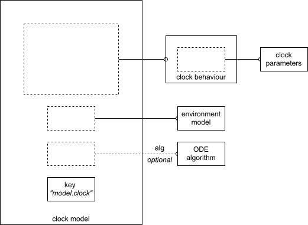

# Clock Models
Provides circadian rhythm model for plant being modelled. 

## Construction

### Components



#### Clock Model

Instance of Clock.Model that brings components together and provides a standard mechanism for executing the model for a given simulation frame.

#### Clock Parameters
Concrete instance of Clock.DynamicParameters for a particular clock model (i.e. Clocks.F2014.COP1 [(Battle et al., 2024)](https://doi.org/10.1016/j.molp.2024.07.007)) that supplies a configured set of parameters used by the clock model behaviour to perform its calculations.

Default value: None (required parameter)

#### Clock Behaviour
Concrete instance of Clock.Dynamics for a particular clock model (i.e. Clocks.F2014.COP1) that encapsulates the behaviour of the clock model typically as a set of Ordinary Differential Equations.

Default value: None (required parameter)

#### Environment Model
Concrete instance of an [environment model](../environment/environment-model.md) (Environment.Model) which supplies a State  (Environment.State) instance describing the environment at a given time point.

Default value: None (required parameter)

#### ODE algorithm
Instance of an ODE algorithm solver from the SciML Ordinary Differential Equation package.

Default value: `QNDF(autodiff=false)`

#### Key
String parameter used to identify & access state, output & tracing elements within the appropriate simulation frame store.

Default value: "model.clock"

### Implementation
The implementation of the clock model components are spread over a number of files within PlantModelFramework package. 
```julia
# PlantModelFramework package files relating to clock models
+ src / 
| 
+-- Clock.jl
| 
+-+ Clocks /
| |
| +-- Clocks.jl
| |
| +-- F2014.jl
| |  
| +-+ Data /
| | |
| | +-+ F2014 /
| | | |
| | | +-- Parameters.tsv
```

#### src/Clock.jl 

Contains the implementation of the [Clock Model](#Clock Model) wrapper that provides the boilerplate code for clock models. 

#### src/Clocks/  

Contains specific clock model behaviour implementations. 

#### src/Clocks/Clocks.jl 

Defines the clocks sub-package namespacing. 

#### src/Clocks/F2014.jl 

Contains [Clock Parameters](#Clock Parameters) & [Clock Behaviour](#Clock Behaviour) implementation for `COP1` & `Red` models. ([(Battle et al., 2024)](https://doi.org/10.1016/j.molp.2024.07.007)).

#### src/Clocks/Data/ 

Root container for any data files required by model implementation.

#### src/Clocks/Data/F2014/ 

Implementation data container for F2014 models.

#### src/Clocks/Data/F2014/Parameters.tsv

Configuration data used by differential equations F2014 models. 


For details on the clock models implemented by PlantModelFramework please [implemented-models.md](implemented-models.md).

### Example

```julia
# - environment model
environment = Environment.ConstantModel(sunset=8)

# circadian (clock) model
# - configuration
clockParameters = Clocks.F2014.COP1.parameters(Set(["wt"]))
    
clockBehaviour  = Clocks.F2014.COP1.dynamics(clockParameters)

clock = Clock.Model(environment, clockBehaviour)
```

## Using A Clock Model
A clock model typically needs entraining to establish an a stable response to the environmental inputs that can then be used to obtain an initial state for the start of the simulation.

The Clock.entrain() function provides this facility and updates the supplied initial (T0) simulation frame with the entrained start conditions for the simulation. 

Clock.entrain() runs the constructed clock model for a specified number of days, with a specified photoperiod, from a given initial state. The model is then run for a day with the model's configured environment to update the initial simulation state.

Once the simulation's initial state is configured the model is ready for use. Construct a PlantModel instance describing the plant system and then run the simulation for a specified number of days from the supplied initial conditions. On completion the simulation will return the simulation frames for each time step in chronological order. The clock state, output & tracing can be obtained from these results and introspected using standard Julia mapping techniques. 

### Example
```julia
# simulation initial conditions
# - conditions @ T0
initialFrame = Simulation.Frame()

# - prepare clock model (initial conditions -> initial T0 frame)
Clock.entrain(clock, Clocks.F2014.COP1.initialState(), initialFrame)

# construct plant simulation
plant = PlantModel(clock)
    
# run simulation    
simulationResults = PlantModelFramework.run(plant, 40, initialFrame)
```

## Creating A New Clock Model
When creating a new clock model it's a good idea to review one of the existing implementations in PlantModelFramework.Clocks sub-package before building your own. The clock model implementations can all be found in `src / Clocks /` within the PlantModelFramework package. `F2014.jl` contains implementations of clock behaviour for `COP1` & `Red` models. These models share a common core behaviour with their differences focussing on the response to blue and red light respectively.

Given a set of _n_ differential equations describing a plant's circadian model the following steps will walk you through creating a clock model compatible with the PlantModelFramework.

Before we get started, it should be noted that Julia's dependency management system (`include`,`import` & `using`) is sensitive to the relative locations of one's files within a directory hierarchy. As a consequence this guide will assume the new clock model is being created in the root directory of the PlantModelFramework repository. 

### Creating Your Model

#### \#1: Create A Module
Create a module of your own, e.g. ExperimentalClock, which will most likely be in a similarly named Julia source code file `ExperimentalClock.jl`.

#### \#2: Create The Boilerplate
As discussed above, there are a number of components that are required for a clock model. We'll stub out these elements in line with the existing clock implementations and then fill in these placeholders one at a time to implement the model.

```julia
module ExperimentalClock

# dependencies 
# - your code will go here

# initial conditions
# - your code will go here

# clock parameters
# - your code will go here

# clock behaviour
# - your code will go here

end
```

#### \#3: Dependencies
Import the elements of PlantModelFramework necessary for building a clock model:

```julia
# dependencies

using PlantModelFramework
```

#### \#4: Initial Conditions
Create a function that returns an instance of Clock.State initialised with a vector of _n_ values suitably configured as the initial state of the differential equations. The initial state vector should provide an initial value for each of the differential equations in your set.

In the example below, our model has 2 differential equations and we initialise all of them to 0.1.

```julia
# initial conditions

function initialState()

    Clock.State( ones(1,2) .* 0.1 )

end
```

#### \#5: Clock Parameters
Create a struct that defines the parameters used by the clock model behaviour. 

Note that due to the internal structure of PlantModelFramework this struct is still required if your model has no parameters. In this circumstance create a struct with no parameters or a single placeholder parameter as desired.

Create a function that returns a correctly configured instance of the model parameters. 

The example below is extremely simple and does not allow for the configuration of parameters in a dynamic fashion. 

Clocks.F2014.COP1 in PlantModelFramework loads the parameter values from a look-up table and modifies the parameters based on the genotype to be simulated (wildtype ("wt"), or one of the predefined mutants). The particular column of the look-up table (parameter sets from [(Fogelmark & Troein, 2014)](https://doi.org/10.1371/journal.pcbi.1003705)) and the genotype are passed to the parameters() function as arguments and used to select and modify the values loaded from a data file bundled within PlantModelFramework/src/Clocks/Data. If loading data from a file it's a good idea to consider tagging your struct with the @kwdef macro ([Julia Docs](https://docs.julialang.org/en/v1/base/base/#Base.@kwdef)) to simplify the initialisation of your struct. 

```julia
# clock parameters

struct Parameters <: Clock.DynamicsParameters
    a
    b
    c
end

function parameters()

    Parameters(1.0,2.0,3.0)

end
```

#### \#6: Clock Behaviour
The clock model behaviour requires four functions be created. Three of these are model-specific boilerplate and can be cribbed directly from the example below. Please ensure that the `Parameters` type specifier is altered to match the name you gave your clock model's parameters.

##### Boilerplate

Create a factory function that returns a Clock.Dynamics instance for your model's parameters. The parameters argument's type `Parameters` is used by Julia's type-dispatch mechanism to ensure that the solver calls the correct model-specific handler functions (methods in Julia's terminology) for your clock model. Please ensure this matches the struct type for your clock parameters. 

Next it's necessary to create two functions to handle the callbacks from SciML / OrdinaryDifferentialEequations' solver. The solver expects a specific set of parameters be handled so these functions must be implemented as per the example below, changing only the `Parameters` type specifier to reflect the name you gave your parameters struct. These dispatch functions will handle the callback from the solver when tracing is disabled or enabled and call your model behaviour.

##### Model Behaviour

Create a function that encapsulates the model behaviour. This function calculates the set of values of the derivatives (du) based on the current values of the variables (u) from the set of differential equations defining your model's behaviour. This method is called from the dispatch functions we created earlier and handles the calculation and any tracing behaviour we may desire if the tracing store is supplied. This function should accept the parameters passed via the solver dispatch methods.

```julia
# clock behaviour 

# - 'factory' for wrapping model-specific behaviour within common 
#   clock functionality

function dynamics(parameters::Parameters)

    dynamics = Clock.Dynamics(parameters)

end

# - SciML / OrdinaryDifferentialEquations dispatch functions 
#   called by solver depending on whether tracing is enable or not

# -- tracing: disabled
function (d::Clock.Dynamics{<: Parameters})(
		 # array of time derivatives to be calculated
        du,                          
        # array of the current values of the state variables of the system
        u,                           
        # call parameters: Environment.State @ time point
        envState::Environment.State, 
        # time
        time
        )

     behaviour(du, u, time, d.parameters, envState, nothing)

end

# -- tracing: enabled
function (d::Clock.Dynamics{<: Parameters})(
		 # array of next values to be calculated
        du,                          
        # array of previously calculated values
        u,                           
        # call parameters: Environment.State @ time point, trace store
        callParameters::Tuple{Environment.State, Dict{Any,Any}},
        # time
        time
        )

     (envState, tracing) = callParameters

     behaviour(du, u, time, d.parameters, envState, tracing)

end

# - model-specific behaviour for ExperimentalClock

function behaviour(du, u, time, parameters, envState, tracing)

    # your model implementation goes here, calculate the next differential 
    # equation value for each equation defining the model's behaviour
    # - replace these terms with your differential equation set
    # e.g.
    du[1] = ( u[1] * parameters.b ) - parameters.a
    du[2] = ( u[2] * parameters.c ) - parameters.a

    # tracing

    if (!(isnothing(tracing)))

        # implement any tracing behaviour here

        day  = Environment.day(envState)
        pp   = Environment.photoperiod(envState)
        
        tracingValues = [ 
           ("1",pp,day,time,du[1],u[1],parameters.a,parameters.b),
           ("2",pp,day,time,du[2],u[2].parameters.a, parameters.c)
        ]

        # cache tracing

        cache = get!(tracing, "ExperimentalClock", [])

        push!(cache, tracingValues)

    end
end
```

The differential equations defined in `behaviour()` are purely illustrative an do not represent any meaningful model of circadian behaviour.

### Using Your Model
To use your new clock model, include the clock model file & import its module into the REPL or your script. You can then follow the same steps as per the example in the README but substituting your module `ExperimentalClock` for `Clocks.F2014.COP1.`. 

```julia
# dependencies

# - framework
using PlantModelFramework

# - new clock model
include("ExperimentalClock.jl")

import .ExperimentalClock

# simulation initial conditions
# - conditions @ T0
initialFrame = Simulation.Frame()

# - environment model
environment = Environment.ConstantModel(sunset=8)

# circadian (clock) model
# - configuration
clockParameters = ExperimentalClock.parameters()
    
clockBehaviour  = ExperimentalClock.dynamics(clockParameters)

clockModel = Clock.Model(environment, clockBehaviour)

# - prepare clock model (initial conditions -> initial T0 frame)
Clock.entrain(clockModel, ExperimentalClock.initialState(), initialFrame)

# construct plant simulation
plantModel = PlantModel(clockModel)
    
# run simulation    
simulationResults = PlantModelFramework.run(plantModel, 40, initialFrame)
```

We can then interrogate the simulation results. For example, the state recorded at 24h on each day of the simulation:
```julia
statesAt24h = 
    map(frame -> ( Simulation.getState(frame, clockModel.key) ).U, simulationResults)
```

This will extract the interpolated state of the clock model's differential equations at 24h from each simulation frame including the initial T0 frame (initialFrame) which contains the entrained values. 

```
41-element Vector{Matrix{Float64}}:
 [-2.130103781772723e204 -2.863500505831363e306]
 [-2.130103781772723e204 -2.863500505831363e306]
 [-2.130103781772723e204 -2.863500505831363e306]
 [-2.130103781772723e204 -2.863500505831363e306]
 [-2.130103781772723e204 -2.863500505831363e306]
 [-2.130103781772723e204 -2.863500505831363e306]
 [-2.130103781772723e204 -2.863500505831363e306]
 [-2.130103781772723e204 -2.863500505831363e306]
 [-2.130103781772723e204 -2.863500505831363e306]
 [-2.130103781772723e204 -2.863500505831363e306]
 [-2.130103781772723e204 -2.863500505831363e306]
 [-2.130103781772723e204 -2.863500505831363e306]
 [-2.130103781772723e204 -2.863500505831363e306]
 [-2.130103781772723e204 -2.863500505831363e306]
 [-2.130103781772723e204 -2.863500505831363e306]
 [-2.130103781772723e204 -2.863500505831363e306]
 [-2.130103781772723e204 -2.863500505831363e306]
 [-2.130103781772723e204 -2.863500505831363e306]
 [-2.130103781772723e204 -2.863500505831363e306]
 [-2.130103781772723e204 -2.863500505831363e306]
 [-2.130103781772723e204 -2.863500505831363e306]
 [-2.130103781772723e204 -2.863500505831363e306]
 [-2.130103781772723e204 -2.863500505831363e306]
 [-2.130103781772723e204 -2.863500505831363e306]
 [-2.130103781772723e204 -2.863500505831363e306]
 [-2.130103781772723e204 -2.863500505831363e306]
 [-2.130103781772723e204 -2.863500505831363e306]
 [-2.130103781772723e204 -2.863500505831363e306]
 [-2.130103781772723e204 -2.863500505831363e306]
 [-2.130103781772723e204 -2.863500505831363e306]
 [-2.130103781772723e204 -2.863500505831363e306]
 [-2.130103781772723e204 -2.863500505831363e306]
 [-2.130103781772723e204 -2.863500505831363e306]
 [-2.130103781772723e204 -2.863500505831363e306]
 [-2.130103781772723e204 -2.863500505831363e306]
 [-2.130103781772723e204 -2.863500505831363e306]
 [-2.130103781772723e204 -2.863500505831363e306]
 [-2.130103781772723e204 -2.863500505831363e306]
 [-2.130103781772723e204 -2.863500505831363e306]
 [-2.130103781772723e204 -2.863500505831363e306]
 [-2.130103781772723e204 -2.863500505831363e306]
```

As noted above, the differential equations representing the model's behaviour are merely illustrative. In a genuine implementation of a clock model these outputs would represent the levels of expression of various metabolites related to the organism's response to changes in the environment over time.  
