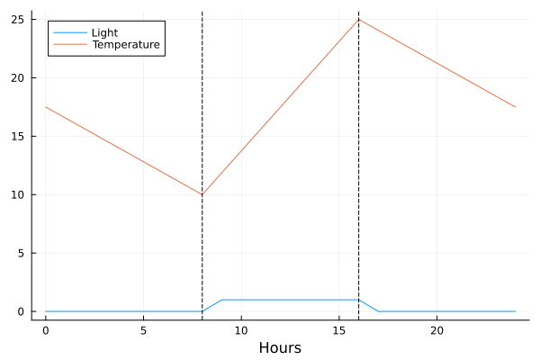

# Environment Models
Provides a consistent and reproducible description of the state of the environment for a given time point. Time points are typically expressed as a day plus an hour in the simulation run.

## Construction

### Components

None. The environment is a discrete functional unit. 

## Using An Environment Model

### Creating An Environment Model
An environment model is created by calling the appropriate constructor to create a model. 

Currently PlantModelFramework only contains a single, simple, environment model __ConstantModel__ which provides a mostly steady state environment allowing only for variations in the photoperiod. __ConstantModel__ can be configured with a number of keyword parameters outlined below. If none of these are supplied the returned environment model as a temperature of 22ºC, a photoperiod of 0 hours & a day duration of 24 hours.

#### Example

```julia
# - constant environment model
#   constructor arguments:
#   > temperature=##.# (degrees Celcius) | default = 22.0
#   > sunrise=#        (hour from 0000)     | default = 0
#   > sunset=#         (hour from 0000)     | default = 0         

environment = Environment.ConstantModel(sunset=8)

```

### Using An Environment Model

A description of the state of the environment is obtained by calling the environment model with arguments detailing the point in time. The returned state is a struct containing parameters describing the environment.

The state description can either be interrogated directly or via accessor functions.

```julia
struct State
    day::Int32              # timepoint day  : 0+
    hour::Int8              # timepoint hour : 1 - 24
    temperature::Float32    # temperature @ timepoint (ºC)
    sunrise::Int8           # hour of sunrise @ timepoint : 0 - 24
    sunset::Int8            # hour of sunrise @ timepoint : 0 - 24
    dayDuration::Int8       # duration of day (default: 24)
end
```

#### Example

```julia
# - state @ midday (1200) on Day 1

state = environment(1, 12)

# - time point at which state created:

timepoint_day = day(state)          # 1
timepoint_hour = hour(state)        # 12

# - duration of day

duration = dayDuration(state)       # 24

# - photoperiod

dawn = sunrise(state)               # 0

dusk = sunset(state)                # 8

pp   = photoperiod(state)           # 8

# - temperature

temp_celcius = temperature(state)   # 22.0 ºC
```

A number of utility functions also exist to support Circadian (Clock) & Phenology models. 

__light_fraction(state)__ models light intensity as square wave returning a value between 0.0 & 1.0 based on the photoperiod & hour the state represents. Currently this is used by the Phenology model to calculate daily photothermal units.

__light_condition(state, time)__ is a less simplistic model of light intensity returning a value between 0.0 & 1.0 based on the photoperiod & a time argument passed from the differential equation solver. Currently this is used in the F2014 clock models and the PIF_CO_FT phenology model.

## Creating A New Environment Model

We are going to implement a model that varies the reported temperature as a simple linear peak centred around the sunset. 

#### \#1: Create A Module

Create a module of your own, e.g. ExperimentalEnv, which will most likely be in a similarly named Julia source code file `ExperimentalEnv.jl`.

#### \#2: Dependencies

At the top of your file add a dependency on the __Environment__ module from the __PlantModelFramework__.

```julia
# Dependencies

using PlantModelFramework.Environment
```
 
#### \#3: Create New Model Boilerplate

The __Environment__ module defines an abstract type for all environment models, __Environment.Model__, which we need to reference when creating our model. 

```julia
struct ExperimentalEnv <: Environment.Model

end
``` 

#### \#4: Create New Model

##### Model Data
Add fields to our a new struct to hold all the data the model needs to calculate the state of a given time point. We can copy a lot of this from the existing __Environment.ConstantModel__ and adjust to suit the needs of this model. Similarly we can draw heavily on the constructor that creates an instance of __Environment.ConstantModel__ for our own.

```julia
struct ExperimentalEnv <: Environment.Model

    # fields

    temperatureMin::Float32 # temperature @ timepoint (ºC)
    temperatureMax::Float32 # temperature @ timepoint (ºC)
    sunrise::Int8           # hour of sunrise @ timepoint : 0 - 24
    sunset::Int8            # hour of sunrise @ timepoint : 0 - 24
    dayDuration::Int8       # duration of day in hours

    # constructor

    function ExperimentalEnv( ;
                              temperatureMin::AbstractFloat=10.0,
                              temperatureMax::AbstractFloat=25.0,
                              sunrise::Integer=0, 
                              sunset::Integer=0,
                              dayDuration::Integer=24)

        # parameter constraints
        # - sunrise <= sunset & 0 | 1:24

        sunriseCorrected = min(sunrise, sunset)
        sunsetCorrected  = max(sunrise, sunset)

        tempMinCorrected = min(temperatureMin, temperatureMax)
        tempMaxCorrected = max(temperatureMin, temperatureMax)

        dayDuration      = max(0, dayDuration)

        # construct

        new(tempMinCorrected, tempMaxCorrected, sunriseCorrected, sunsetCorrected, dayDuration)

    end
end

```

As you can see the _temperature_ field has been replaced with two new fields holding the min and max temperatures the model will move between over the course of the day. We've also updated the constructor function to take arguments for these values along with some basic error checking to ensure that the min value is genuinely less the the max value.

##### Model Behaviour
The purpose of an environment model is to create an instance of __Environment.State__ at a given time point so we need to implement a version of the function `function (m::Model)(day::Integer, hour::Integer)::State`. Since this function is essential for the model to do its job, the __Environment__ module provides a default implementation that raises an error to remind us that we need to implement our own. This function's primary purpose is to document the overall shape the __PlantModelFramework__ expects environment models to take.

__Environment.ConstantModel__ simply copies the values of its configuration into the __State__ instance it creates. __ExperimentalEnv__ will need to calculate the temperature it returns. As a first pass at this we can implement the required function along with a stubbed out function to perform our temperature calculation.

```julia

function _temperature(m, day, hour)
	m.temperatureMin
end

function (m::ExperimentalEnv)(day::Integer, hour::Integer)
    state = State(day, hour, _temperature(m), m.sunrise, m.sunset, m.dayDuration)

end
```

With this in place we can now implement our temperature profile logic. The min temperature will be aligned with sunrise, the max temperature with sunset, and the model will linearly interpolate between these points over the course of the day. If there's no photo period at all we'll default to the min temperature.

```julia
function _temperature(m, day, hour)

    # determine parameters for calculation

    warmingPeriod = m.sunset - m.sunrise
    coolingPeriod = (m.dayDuration - m.sunset) + m.sunrise

    tempDelta   = m.temperatureMax - m.temperatureMin

    temperature = m.temperatureMin
	
	 # calculate temperature

    if warmingPeriod > 0

        if hour > m.sunrise && hour <= m.sunset

            # warming

            timeOffset  = hour - m.sunrise
            
            temperature = ((tempDelta / warmingPeriod) * timeOffset) + m.temperatureMin

        else
            
            # cooling

            timeOffset  = (hour - m.sunset) > 0 ? (hour - m.sunset) : ((m.dayDuration - m.sunset) + hour)
            temperature = (-1.0 * tempDelta / coolingPeriod) * timeOffset + m.temperatureMax

	end

	# model temperature @ day, hour
	return temperature

end
```

This completes our build out of the new environment model.

### Using Your Model

To test our new environment model, we can include the file into the REPL, generate a dataframe, and create a plot of the model behaviour. We'll use the default min & max values and configure the photo period to run from 0800 to 1600.

Having constructed an instance of our model we use the `map()` function to iterate through the hours in a day and use the model to create a state description and then pull data concerning the state of the light and the temperature at each time point. We can stitch this data into a data frame and then plot the results. 

With the behaviour confirmed we can now use __ExperimentalEnv__ in simulation runs using pre-existing circadian (clock) and phenology models.

```julia
using DataFrame
using Plots

using PlantModelFramework

include("ExperimentalEnv.jl")

env = ExperimentalEnv(sunrise=8, sunset=8)

hours = 0:24
light = map(hr -> Environment.light_fraction((env(1,hr))), hours)
temps = map(hr -> Environment.temperature((env(1,hr))), hours)

df = DataFrame(Hour=hours, Light=light, Temperature=temps)

plot(df.Hour, [df.Light, df.Temperature], xlabel="Hours", label=["Light" "Temperature"])

vline!([env.sunrise, env.sunset], linestyle=:dash, color=:black, label="")
``` 

